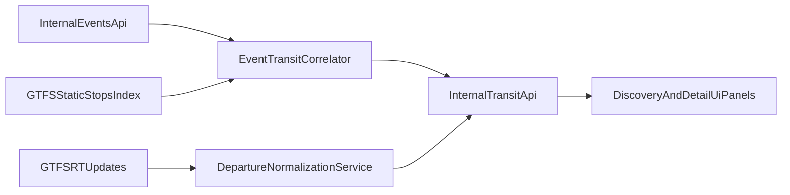

> AI-generated planning artifact. Curated and refined for EvenTallinn V1/V2 transition.

# Sprint 2 Overview - Transit Bridge and Operational Readiness

## Sprint Theme
Extend the Discovery Feed into a mobility-aware experience by correlating events with nearby transit stops and showing real-time departures with resilient fallbacks.

## Strategic Outcome
- Convert static event discovery into decision-ready context (where to go + how to get there now).
- Introduce a geospatial and realtime integration layer without degrading V1 UX quality.
- Preserve product velocity by using explicit contracts and anti-corruption adapters for GTFS data.

## Sprint Goals
- Implement nearest-stop resolution for event coordinates using GTFS static data.
- Expose next departures (top 3) via internal API contract using GTFS-RT ingestion.
- Add event card/detail transit panels with graceful stale-data behavior.
- Add observability and operational guardrails for feed reliability.

## In Scope
- GTFS static ingestion strategy and searchable stop index.
- Transit correlation endpoint(s) behind internal API routes.
- GTFS-RT fetch/parsing for departure predictions.
- UI integration for departures (card or detail-level panel).
- Reliability controls: timeout, retry/backoff, stale-while-revalidate semantics.

## Out of Scope
- Full route planning engine and warm-route optimization.
- Advanced personalization or ranking by user preferences.
- Multi-city expansion.

## Milestones
- **M1 Data Foundations:** GTFS static index + nearest-stop query capability.
- **M2 Realtime Pipeline:** GTFS-RT parsing + normalized departure contract.
- **M3 Product Integration:** Transit snippets in UI with failure-safe rendering.
- **M4 Operational Readiness:** Monitoring, docs, and production hardening checks.

## Definition of Done
- For at least one event source payload, nearest stop and next departures are returned through internal APIs.
- UI presents transport context without blocking core event browsing.
- Realtime/transit failures degrade gracefully and are observable.
- Quality gates pass and technical debt decisions are documented.

## Expected Deliverables
- `plans/sprint-2/overview.md`
- `plans/sprint-2/task-01-gtfs-static-ingestion-and-stop-index.md`
- `plans/sprint-2/task-02-nearest-stop-correlation-contract.md`
- `plans/sprint-2/task-03-gtfs-rt-ingestion-and-departure-normalization.md`
- `plans/sprint-2/task-04-transit-ui-integration.md`
- `plans/sprint-2/task-05-reliability-caching-and-observability.md`
- `plans/sprint-2/task-06-release-readiness-and-retrospective.md`

## Architecture Direction

